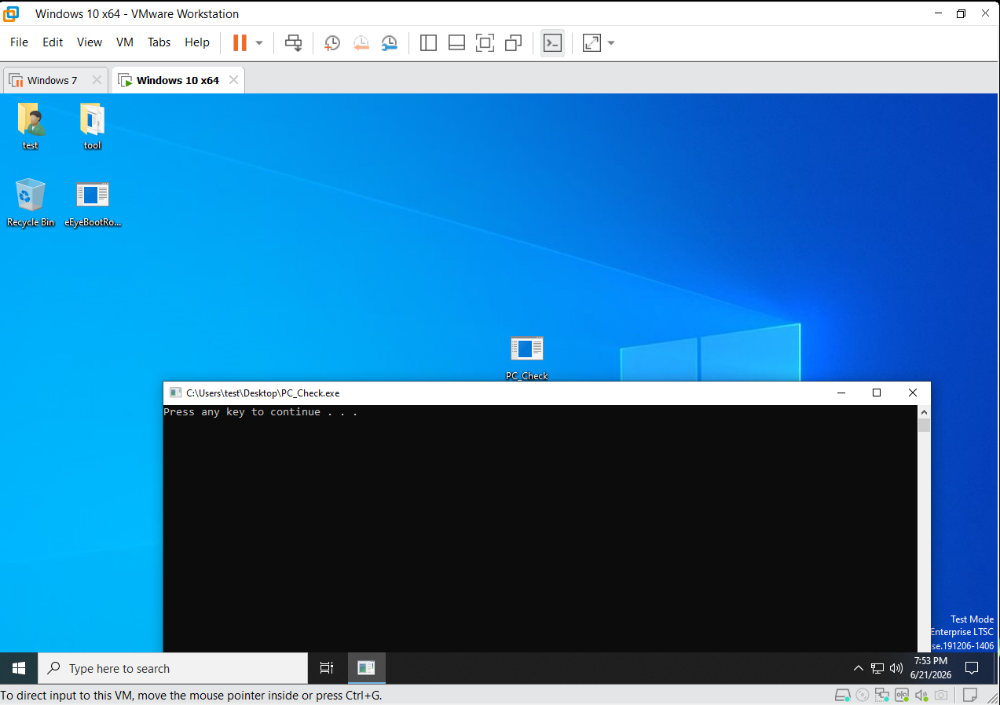
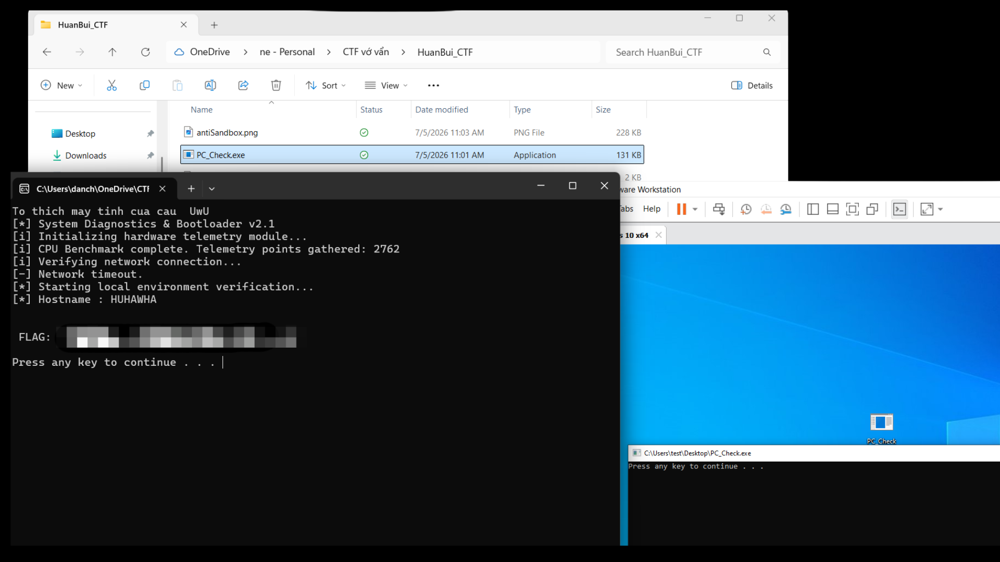

Đề bài viễn tưởng:

Huấn Bùi là 1 trader khét tiếng trong giới , theo như dự đoán anh ta đang hold cả chục xu BTC lưu ở ví trên máy tính. Hacker biết vậy nên đã hack vào máy tính anh ta , sau khi chiếm quyền hacker đã chạy vòng lặp quét liên tục tất cả mọi thứ trên máy tính , tuy nhiên không thể nào tìm được tung tích ví. Nhưng lại thấy Huấn giữ 1 ứng dụng PC\_Check.exe vào 1 nơi rất xâu trong thư mục tên là MoneyMan. Hacker tải về máy và mở lên thì bị crash khó hiểu !

=============================================================

Các kỹ thuật bên trong app bao gồm : 

\* Làm rối\*\* (Obfuscation)

\* Anti-Sandbox / Anti-VMware\*\* (Chống môi trường ảo hóa)

\* Dynamic Anti-Debugging\*\* (Chống gỡ lỗi động)

\* Và một số logic do mình tự vẽ thêm vào ;P

=============================================================
Anti VMware : 

&#x20; 

=============================================================
Chạy trên Host : 

&#x20; 

\*\*Note:\*\*  Ae có thể giải rất nhanh cùng AI ^^. Nhưng đối với mình, đây là app chứa các kỹ thuật cơ bản nhất của các VXer đời đầu. Nếu được, ae hãy học cách \*\*viết ra các kỹ thuật này thay vì chỉ giải nó\*\*. Lúc đó, ae sẽ có cảm giác mình là một họa sĩ thực thụ. 

Có lẽ đó cũng chính là những gì các bậc tiền bối thường mỉm cười khi họ kể lại!

